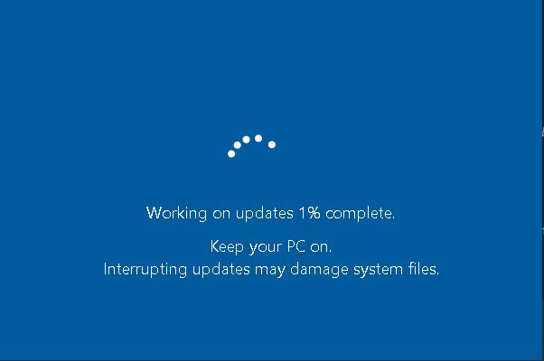
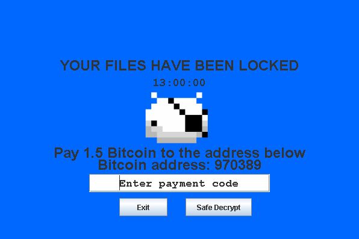
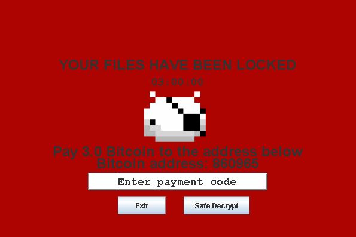
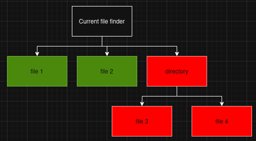
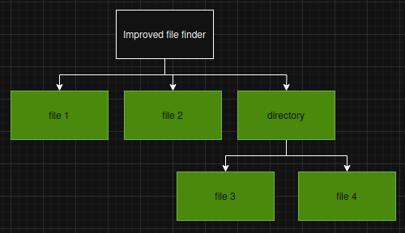

## Legal Disclaimer

This software is provided **strictly for educational, research, and ethical practice purposes only**.

-  **Do NOT use this tool on any system you do not own or have explicit permission to test.**
-  **Unauthorized use of this software may be illegal and is strictly prohibited.**
-  **The author takes no responsibility for any damage, data loss, or legal consequences resulting from misuse.**

By using this software, you agree to use it **ethically, lawfully**, and in **controlled environments such as CTFs, virtual labs, or testing networks**.

This tool is intended to help raise awareness and understanding of security threats — **not to promote or enable criminal activity**.

## Safety Features

- **Safe Decrypt Option:** Instantly restores files to prevent damage during testing.  
- **Reverse Shell:** Runs via Windows CMD for controlled simulation and has a connector for testing.  
- **Limited Impact:** Only files in a safe test folder are affected.
- **Sandboxed Directory** Preventing any other files being accessed in the file server.

## Windows10FakeUpdate  
A fake Windows update screen used as a distraction that encrypts discovered files and estimates a time so it is ready and not as alarming to users. Furthermore, this behaviour can often be related to other malware types, such as viruses, that use that time to spread through vulnerabilities such as zero-days, or even install rootkits onto a compromised machine.

<p align="center">
  
</p>

## InitialPhase  
Initial lock screen phase with timer and shell connection. This is demonstrated as it is often used in real-world TTPs (Tactics, Techniques, and Procedures), and is commonly shown in attackers' OPSEC operations, which they can use to further escalate privileges or obfuscate logs.

<p align="center">
  
</p>

## SecondPhase  
Critical phase with timer and increased demands, file deletion if requirements are met with simulated payment code. If demands are not met, this ethical ransomware runs a wipedown where the user's encrypted files are deleted, simulating similar behaviours to the NotPetya ransomware that would delete a compromised machine's files. In this case, it is simulated and only targets files in a specific directory.  

<p align="center">
  
</p>

# Updates
Cross-platform server with automated command deployment and privilege escalation support for Windows and Linux using LinPEAS and WinPEAS.

## Encrypted TLS Server 
### Current features

- **TLS Encrypted Communication:** Secure connections via Java `SSLServerSocket`.
- **File Serving:** Sends files from a defined `Base_DIR` to clients.
- **Path Traversal Protection:** Blocks access outside the base directory.
- **Event Logging:** Records IP, timestamp, and request outcome in `IPLogs.json`.
- **Threaded Connections:** Supports multiple clients concurrently.
- **Safety Checks:** Logs and blocks invalid or failed requests.

### Features in progress
Add IP whitelisting, password authentication, and more robust logging/error handling.

<details>
<summary>Show/Hide Code</summary>

```java

/**
 * ============================================
 * DISCLAIMER / LEGAL NOTICE
 * ============================================
 *
 * This software is provided strictly for educational purposes, ethical testing,
 * and controlled lab environments. It is intended to demonstrate secure file 
 * serving concepts, logging, and basic TLS communication.
 *
 * DO NOT use this software on public networks, against systems you do not 
 * own, or in any way that violates local laws or regulations. Unauthorized 
 * use may be illegal and could result in criminal or civil penalties.
 *
 * The author assumes no liability for any damage, data loss, or legal consequences 
 * arising from the use or misuse of this software.
 *
 * By using this code, you agree to use it responsibly, ethically, and legally.
 *
 * ============================================
 */

package NetworkShell;

import javax.net.ssl.*;
import java.io.*;
import java.security.KeyStore;
import java.net.Socket;
import java.time.LocalDate;

public class FileServer {

    private static final String Base_DIR = "/ShellSandbox";

    public static void main(String[] args) throws Exception {
        char[] password = "password".toCharArray();
        KeyStore keyStore = KeyStore.getInstance("JKS");
        try (FileInputStream fileInputStream = new FileInputStream("/NetworkShell/server.keystore")) {
            keyStore.load(fileInputStream, password);
        }

        KeyManagerFactory keyManagerFactory = KeyManagerFactory.getInstance("SunX509");
        keyManagerFactory.init(keyStore, password);

        SSLContext sslContext = SSLContext.getInstance("TLS");
        sslContext.init(keyManagerFactory.getKeyManagers(), null, null);

        SSLServerSocketFactory serverSocketFactory = sslContext.getServerSocketFactory();
        SSLServerSocket serverSocket = (SSLServerSocket) serverSocketFactory.createServerSocket(4444);

        System.out.println("TLS File server started on port 4444");

        while (true) {
            SSLSocket clientSocket = (SSLSocket) serverSocket.accept();
            new Thread(() -> handleRequest(clientSocket)).start();
        }
    }

    private static void handleRequest(Socket clientSocket) {

        try (BufferedReader in = new BufferedReader(new InputStreamReader(clientSocket.getInputStream()));
             OutputStream out = clientSocket.getOutputStream()) {

            String filename = in.readLine();
            File file = new File(Base_DIR,filename).getCanonicalFile();
            File base = new File(Base_DIR).getCanonicalFile();

            if (!file.getPath().startsWith(base.getPath())) {
                clientSocket.close();

            } else {

                LocalDate date = LocalDate.now();
                String ip = clientSocket.getInetAddress().getHostAddress();
                String fileRequested = filename;
                Boolean connected = false;

                String clientIP = clientSocket.getInetAddress().getHostAddress();

                if (!file.getPath().startsWith(base.getPath() + File.separator)) {
                    EventLogger(LocalDate.now().toString(), ip, false, filename);
                    System.out.println("Blocked path traversal attempt: " + filename + " from " + ip);
                    clientSocket.close();
                    return;
                }

                if (!file.getPath().startsWith(base.getPath())) {
                    EventLogger(LocalDate.now().toString(), ip, false, fileRequested);
                    clientSocket.close();
                    return;
                }

                if (file.exists() && !file.isDirectory()) {
                    connected = true;
                    EventLogger(LocalDate.now().toString(), ip, connected, fileRequested);
                    System.out.println("Sending file: " + filename +" to "+clientIP);
                    sendFile(out, file);
                } else {
                    connected = false;
                    EventLogger(LocalDate.now().toString(), ip, connected, fileRequested);
                    System.out.println("Not existing file IP:"+clientIP);
                    out.flush();
                }
            }

        } catch (IOException e) {
            e.printStackTrace();
        } finally {
            try { clientSocket.close(); } catch (IOException e) {
                e.printStackTrace();
            }
        }
    }

    private static void EventLogger(String date, String ip, boolean connected, String fileRequested) {
        File logFile = new File("/NetworkShell/IPLogs.json");
        try {
            if (logFile.createNewFile()) {
                System.out.println("File created: " + logFile.getName());
            }

            try (BufferedWriter bw = new BufferedWriter(new FileWriter(logFile, true))) {
                bw.write("{"
                        + "\"date\":\"" + date + "\","
                        + "\"ip\":\"" + ip + "\","
                        + "\"event\":\"" + connected + "\","
                        + "\"fileRequested\":\"" + fileRequested + "\""
                        + "}");
                bw.newLine();
            }

        } catch (IOException e) {
            System.out.println("An error occurred in EventLogger.");
            e.printStackTrace();
        }
    }

    private static void sendFile(OutputStream out, File file) throws IOException {
        try (BufferedInputStream fileIn = new BufferedInputStream(new FileInputStream(file))) {
            byte[] buffer = new byte[4096];
            int bytesRead;
            while ((bytesRead = fileIn.read(buffer)) != -1) {
                out.write(buffer, 0, bytesRead);
            }
            out.flush();
            System.out.println("File: "+file+" has been sent");
        }
    }
}

```
</details> 

## Features included in dir & file creator prototype

- directory and file creation with random dates and times within a year period.
- multi threading added to improve speed
<details>
<summary>Show/Hide Code</summary>

```java

//Disclamer!
//To prevent any harm to your machine use this code in a safe/testing environment only.
//I do not take any liability for the codes use.

//Usage
//Only run this code in compliance with local laws and on systems you own or are authorized to

import java.io.FileOutputStream;
import java.io.IOException;
import java.nio.file.*;
import java.nio.file.attribute.BasicFileAttributeView;
import java.nio.file.attribute.FileTime;
import java.time.Instant;
import java.util.Random;

public class DistractionFileCreator {

// Write random bytes into a file to mimic encrypted content

public static void writeRandomBytes(Path file, int minBlocks, int maxBlocks) throws IOException {

    Random random = new Random();

    int blocks = random.nextInt(maxBlocks - minBlocks + 1) + minBlocks;

    try (FileOutputStream fos = new FileOutputStream(file.toFile())) {

        for (int i = 0; i < blocks; i++) {

            byte[] randomBytes = new byte[64]; // 64 bytes per block

            random.nextBytes(randomBytes);

            fos.write(randomBytes);

        }

    }

}

// Set random file creation/modification times

private static void setRandomFileTime(Path path) throws Exception {

    Random random = new Random();

    FileTime randomTime = FileTime.from(

            Instant.now().minusSeconds(random.nextInt(60 * 60 * 24 * 365))

    );

    BasicFileAttributeView view = Files.getFileAttributeView(path, BasicFileAttributeView.class);
    view.setTimes(randomTime, randomTime, randomTime);

}
public static void shutdown() {
    System.out.println("Process complete!");

    System.exit(0);

}

public static void DirectoryCreator() {
    Random rand = new Random();

    for (int rp = 0; rp < 15; rp++) {

        // Safe characters for Windows folder names
        String dirChars = "abcdefghijklmnopqrstuvwxyzABCDEFGHIJKLMNOPQRSTUVWXYZ0123456789";

        StringBuilder name = new StringBuilder();

        for (int i = 0; i < 16; i++) {

            name.append(dirChars.charAt(rand.nextInt(dirChars.length())));

        }

        Path path = Paths.get(name + ".encrypted");

        try {

            Files.createDirectory(path);

            System.out.println("Directory created: " + path);

            setRandomFileTime(path);

            int fnum = rand.nextInt(20); // number of files per directory

            for (int frp = 0; frp < fnum; frp++) {

                // Generate safe file name

                StringBuilder fileName = new StringBuilder();

                for (int i = 0; i < 16; i++) {

                    fileName.append(dirChars.charAt(rand.nextInt(dirChars.length())));

                }

                fileName.append(".encrypted");

                Path testFile = Paths.get(path.toString(), fileName.toString());
                Files.createFile(testFile);
                setRandomFileTime(testFile);
                System.out.println("File created: " + testFile);
                // Fill the file with random bytes
                writeRandomBytes(testFile, 5, 30); // 5-30 blocks of 64 bytes
            }
        } catch (Exception e) {
            System.out.println("Error: " + e);
        }
    }
    shutdown();
}
public static void main(String[] args) {
    DirectoryCreator();
}
}  

```
</details> 

# Current isues
The current file discovery process fails when the specified path includes a directory. Once it encounters a directory, it is unable to encrypt any files contained within its subdirectories.

## Current file discovery
<p align="center">
  
</p>

## Updated file discovery

<p align="center">
  
</p>
